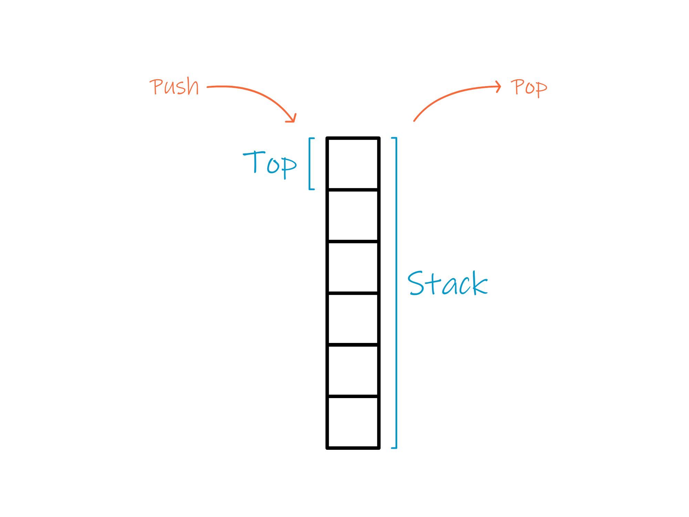
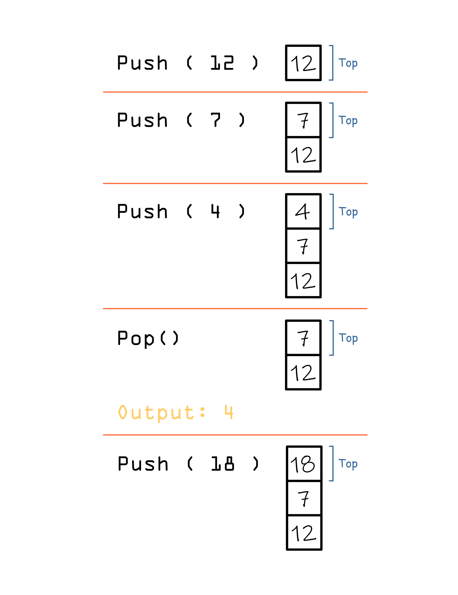

# Stack

> A stack is a LIFO structure (Last In First Out). That means that if we add 3 numbers, the only one of them that we can access to, is the last one we added (the one that is on top).
> \n
> To add a number we use "push", and to delete a number we use "pop"

> Every time a number is pushed (added) it goes on top, so if we pop (delete) a number, top changes.

